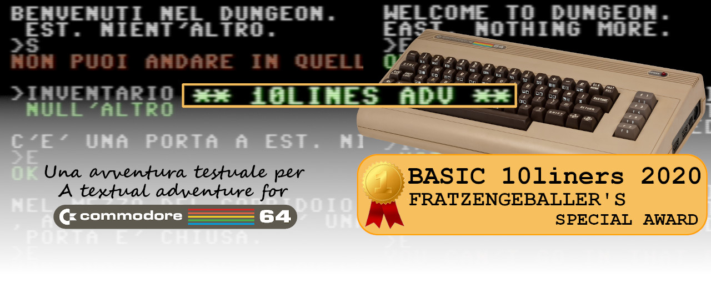

# 10LINES ADV

**10LINES ADV** è un gioco di avventura per gli home computer [COMMODORE 64](https://it.wikipedia.org/wiki/Commodore_64). In questo gioco, il giocatore assume il ruolo di protagonista in una storia interattiva, guidata dall'esplorazione e dalla risoluzione di enigmi. Questo gioco è progettato per un singolo giocatore, usa la sola modalità testo e un interprete per tradurre ciò che digita il giocatore in comandi.

[Cliccare qui](/docs/instructions.md) per leggere le istruzioni su come giocare, e [qui](https://github.com/spotlessmind1975/adv10/blob/master/adv10-all.d64) per scaricare l'immagine del disco (formato: D64). 
L'immagine contiene sia la versione in italiano che la versione [in lingua inglese](https://github.com/spotlessmind1975/adv10en).

Questo gioco è stato creato per partecipare alla ["BASIC10Liner" competition 2020](https://gkanold.wixsite.com/homeputerium/2020), nella quale l'[edizione inglese](https://github.com/spotlessmind1975/adv10en) del gioco è arrivata prima, vincendo il **[FRATZENGEBALLER'S SPECIAL AWARD](https://gkanold.wixsite.com/homeputerium/kopie-von-results-2018)**. 

Poiché partecipava a questo concorso, il gioco è di modeste dimensioni (nonostante abbia due enigmi), il codice sorgente rispetta dei vincoli molto stringenti sulla lunghezza di ogni riga (categoria: **EXTREME-256**) e non si affida a librerie di terze parti. Per coloro che sono interessati, è disponibile anche [una edizione inglese](https://github.com/spotlessmind1975/adv10en).

Per coloro che volessero approfondire i dettagli della sua implementazione (**ATTENZIONE: SPOILERS!**), per favore fate riferimento ai seguenti documenti:
 *  [il sorgente commentato](/docs/source.md)
 *  [il parser](/docs/parser.md)
 *  [lo stato interno del gioco](/docs/game-state.md)
 *  [il metodo di compressione](/docs/compression.md)

Ti sei bloccato? Trova dei suggerimenti [su questa pagina](docs/suggestions.md).
Qui, invece, trovi [la soluzione completa](docs/solution.md).