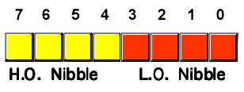
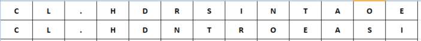
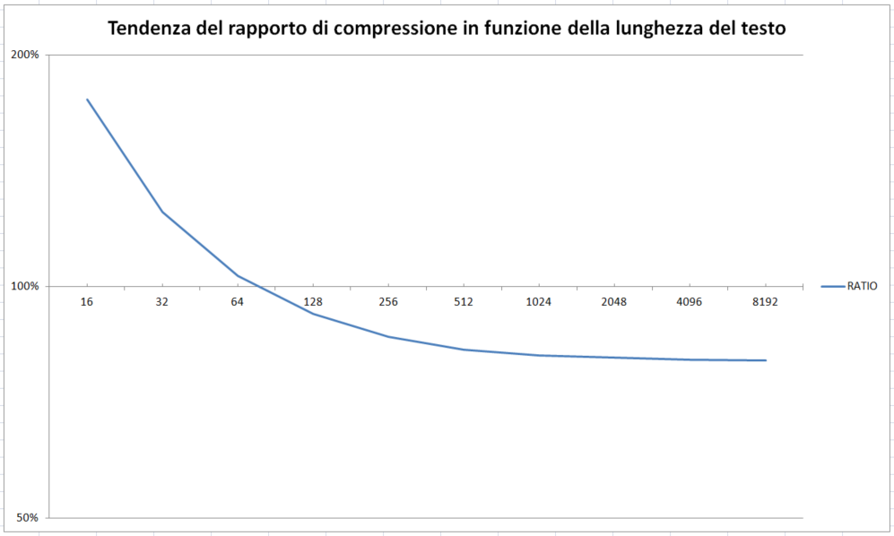

# COMPRESSIONE DEI TESTI A "NIBBLE"

Uno degli elementi più "ingombranti" dei programmi scritti in BASIC V2 sono sicuramente i testi: messaggi di errore, descrizioni, etichette, istruzioni ... tutto deve essere fortemente ridotto per risparmiare spazio prezioso per il resto del programma. Questo vale sia per tutti i tipi di applicazioni, compresi i giochi, e diventa fondamentale in quei giochi in cui i testi sono essenziali.

Mi riferisco, ovviamente, alle cosiddette "avventure testuali" e sarebbe fantastico se trovassimo un modo per rappresentare i testi in modo più "compatto".

In generale, il modo migliore per risolvere questo problema è prendere in considerazione la bassa variabilità delle lettere e, quindi, utilizzare una rappresentazione a nibble (4 bit) anziché a byte (8 bit).

Questo approccio ridurrebbe idealmente l'occupazione dello spazio necessario esattamente a metà. Ovviamente, possiamo rappresentare solo 16 simboli (0 ... 15), che sono insufficienti per tutte le lettere dell'alfabeto e un segno di punteggiatura (28 lettere: a-z, il punto "" e lo spazio).

Tuttavia, se assegnassimo le lettere più frequenti in quel testo a questi 16 simboli, **ridurremmo statisticamente l'occupazione di memoria** poiché useremo più frequentemente un nibble anziché un byte.

Per poter codificare qualsiasi testo generico, dovremo comunque sacrificare alcuni dei valori rappresentabili, per introdurre un meccanismo per tornare (temporaneamente) alla rappresentazione a 8 bit, quando se ne ravveda il bisogno.

Per fare un esempio, prenderò il seguente testo da [10LINES ADV (edizione italiana)](https://github.com/spotlessmind1975/adv10):

> NEL MEZZO DEL CORRIDOIO. VEDI DUE STANZE, A NORD E SUD. C'E' UNA PORTA A EST.

Questa stringa è lunga esattamente 78 caratteri e ha 19 lettere diverse. Se lo rappresentiamo utilizzando caratteri a 8 bit, occuperebbe esattamente 78 byte.

<table>
    <tr>
        <td>"N"</td>
        <td>"E"</td>
        <td>"L"</td>
        <td>(spazio)</td>
        <td>"M"</td>
        <td>"E"</td>
        <td>...</td>
    </tr>
</table>

Supponiamo ora di utilizzare la seguente tabella di corrispondenze, ordinando le lettere dalla più frequente alla meno frequente in quel testo:

<table>
    <tr>
        <th>LETTERA</th>
        <th>DECIMALE (4 bit)</th>
        <th>ESADECIMALE (4 bit)</th>
    </tr>
    <tr>
        <td>"E"</td>
        <td>1</td>
        <td>1</td>
    </tr>
    <tr>
        <td>"O"</td>
        <td>2</td>
        <td>2</td>
    </tr>
    <tr>
        <td>"D"</td>
        <td>3</td>
        <td>3</td>
    </tr>
    <tr>
        <td>"A"</td>
        <td>4</td>
        <td>4</td>
    </tr>
    <tr>
        <td>"N"</td>
        <td>5</td>
        <td>5</td>
    </tr>
    <tr>
        <td>"R"</td>
        <td>6</td>
        <td>6</td>
    </tr>
    <tr>
        <td>"T"</td>
        <td>7</td>
        <td>7</td>
    </tr>
    <tr>
        <td>"S"</td>
        <td>8</td>
        <td>8</td>
    </tr>
    <tr>
        <td>"U"</td>
        <td>9</td>
        <td>9</td>
    </tr>
    <tr>
        <td>"I"</td>
        <td>10</td>
        <td>A</td>
    </tr>
    <tr>
        <td>"."</td>
        <td>11</td>
        <td>B</td>
    </tr>
    <tr>
        <td>"Z"</td>
        <td>12</td>
        <td>C</td>
    </tr>
    <tr>
        <td>"C"</td>
        <td>13</td>
        <td>D</td>
    </tr>
    <tr>
        <td>(escape)</td>
        <td>14</td>
        <td>E</td>
    </tr>
    <tr>
        <td>(spazio)</td>
        <td>15</td>
        <td>F</td>
    </tr>
</table>

Ora prendiamo una parte del testo precedente ed esprimiamolo usando i numeri esadecimali della tabella delle frequenze precedente:

<table>
    <tr>
        <td>"D"</td>
        <td>"U"</td>
        <td>"E"</td>
        <td>(spazio)</td>
        <td>"S"</td>
        <td>"T"</td>
        <td>...</td>
    </tr>
    <tr>
        <td>3</td>
        <td>9</td>
        <td>1</td>
        <td>D</td>
        <td>8</td>
        <td>7</td>
        <td>...</td>
    </tr>
</table>

Poiché tutti questi numeri possono essere rappresentati con un solo nibble (4 bit), possono essere "raggruppati" in un singolo byte ogni due nibble (8 bit):

<table>
    <tr>
        <td>"DU"</td>
        <td>"E" (spazio)</td>
        <td>"ST"</td>
        <td>...</td>
    </tr>
    <tr>
        <td>39</td>
        <td>1D</td>
        <td>87</td>
        <td>...</td>
    </tr>
</table>

Il testo "due st", che in precedenza occupava 6 byte, dopo il "processo" occupa solo 3 byte. **Pertanto abbiamo risparmiato il 50% dello spazio!**

Se la lettera non è tra quelle in corrispondenza, abbiamo bisogno di un valore aggiuntivo, il valore (escape) (14, hex. E). Questo valore rappresenta una "sequenza di escape" e indica che la lettera non verrà rappresentata con un nibble ma con il byte successivo.

Nell'esempio sopra, se dovessimo tradurre "ME" avremmo avuto la seguente sequenza:

<table>
    <tr>
        <td>"M"</td>
        <td>"E"</td>
        <td></td>
        <td></td>
        <td>...</td>
    </tr>
    <tr>
        <td>E</td>
        <td>1</td>
        <td>7</td>
        <td>7</td>
        <td>...</td>
    </tr>
</table>

Quindi: 2 byte per 2 byte, e ovviamente non vi sono risparmi.

Può succedere che vi siano due lettere che non possono essere tradotte in una sequenza. In questo caso, avremo **DUE** sequenze di escape e due caratteri nella coda: quindi 3 byte per 2 byte e avremo una perdita.

Ad esempio:

<table>
    <tr>
        <td>"M"</td>
        <td>"M"</td>
        <td></td>
        <td></td>
        <td></td>
        <td></td>
        <td>...</td>
    </tr>
    <tr>
        <td>E</td>
        <td>E</td>
        <td>7</td>
        <td>7</td>
        <td>7</td>
        <td>7</td>
        <td>...</td>
    </tr>
</table>

Purtroppo, a seconda del sistema di destinazione dove si andrà a rappresentare la sequenza di byte così ottenuta, alcune di queste combinazioni potrebbero non essere valide, per uno o più di questi motivi (sono ordinati dal motivo più grave a quello più lieve, e tra parentesi ho indicato il livello di "gravità"):

* **si potrebbe impedire il listing corretto del programma**, perché dando il comando <code>LIST</code> i caratteri apparirebbero più volte o non apparirebbero affatto, oppure ingenererebbero un errore di sintassi (LIVELLO 1);
* **si potrebbe impedire la digitazione del listato usando l'editor integrato**, perché alcuni caratteri non sarebbero digitabili  (LIVELLO 2);
* **si potrebbe impedire il "riediting"**, perché la rappresentazione potrebbe cambiare con una modifica a posteriori (LIVELLO 3);
* **si potrebbero introdurre dei caratteri ambigui**, per i quali vi sono più codici corrispondenti (LIVELLO 4).

A tal riguardo è stato condotto uno studio empirico sui caratteri del COMMODORE 64, il quale mi ha portato a stilare una classifica secondo il succitato livello di gravità nei loro effetti collaterali, nel caso venissero adottati:

<table>
    <tr>
        <th>LIVELLO</th>
        <th>CARATTERI (dec./esad.)</th>
    </tr>
    <tr>
        <td>
        LIVELLO 1
        </td>
        <td>
            <table>
                <tr>
                    <td>
                        0
                    </td>
                    <td>
                        00
                    </td>
                    <td>
                    </td>
                </tr>
                <tr>
                    <td>
                        10
                    </td>
                    <td>
                        0A
                    </td>
                    <td>
                        E' il carattere di <code>LINE FEED</code>.
                    </td>
                </tr>
                <tr>
                    <td>
                        13
                    </td>
                    <td>
                        0D
                    </td>
                    <td>
                        E' il carattere di <code>INVIO</code>.
                    </td>
                </tr>
                <tr>
                    <td>
                        20
                    </td>
                    <td>
                        14
                    </td>
                    <td>
                        E' il carattere per cancellare un carattere: se utilizzato
                        "mangia" il carattere alla sua sinistra, tornando indietro di
                        una posizione quando si effettua il <code>LIST</code>
                    </td>
                </tr>
                <tr>
                    <td>
                        34
                    </td>
                    <td>
                        22
                    </td>
                    <td>
                        Sono le virgolette, che l'interprete utilizza per
                        delimitare le stringhe nel listato BASIC V2.
                    </td>
                </tr>
                <tr>
                    <td>
                        141
                    </td>
                    <td>
                        8D
                    </td>
                    <td>
                        E' la pressione dello SHIFT + RETURN: se utilizzato
                        "manda a capo" quando si effettua il <code>LIST</code>
                    </td>
                </tr>
            </table>
        </td>
    </tr>
    <tr>
        <td>
        LIVELLO 2
        </td>
        <td>
            <table>
                <tr>
                    <td>
                        130
                    </td>
                    <td>
                        81
                    </td>
                    <td rowspan="5">
                    Si tratta di caratteri per i quali non c'è una
                    sequenza sulla tastiera del C=64 in grado di introdurli.
                    </td>
                </tr>
                <tr>
                    <td>
                        131
                    </td>
                    <td>
                        82
                    </td>
                </tr>
                <tr>
                    <td>
                        132
                    </td>
                    <td>
                        83
                    </td>
                </tr>
                <tr>
                    <td>
                        143
                    </td>
                    <td>
                        8f
                    </td>
                </tr>
                <tr>
                    <td>
                        222
                    </td>
                    <td>
                        de
                    </td>
                </tr>
            </table>
        </td>
    </tr>
    <tr>
        <td>
        LIVELLO 3
        </td>
        <td>
            <table>
                <tr>
                    <td>
                        96
                    </td>
                    <td>
                        60
                    </td>
                    <td rowspan="3">
                    Sono caratteri che, se modificati,
                    sono riconvertiti nei loro codici
                    duplicati.
                    </td>
                </tr>
                <tr>
                    <td>
                        ...
                    </td>
                    <td>
                        ...
                    </td>
                </tr>
                <tr>
                    <td>
                        127
                    </td>
                    <td>
                        7f
                    </td>
                </tr>
                <tr>
                    <td>
                        224
                    </td>
                    <td>
                        e0
                    </td>
                    <td rowspan="3">
                    Sono caratteri che, se modificati,
                    sono riconvertiti nei loro codici
                    duplicati.
                    </td>
                </tr>
                <tr>
                    <td>
                        ...
                    </td>
                    <td>
                        ...
                    </td>
                </tr>
                <tr>
                    <td>
                        253
                    </td>
                    <td>
                        7f
                    </td>
                </tr>
            </table>
        </td>
    </tr>
    <tr>
        <td>
        LIVELLO 4
        </td>
        <td><table>
                <tr>
                    <td>
                        192
                    </td>
                    <td>
                        c0
                    </td>
                    <td rowspan="3">
                    Sono caratteri che hanno la stessa
                    rappresentazione grafica di altri caratteri.
                    </td>
                </tr>
                <tr>
                    <td>
                        ...
                    </td>
                    <td>
                        ...
                    </td>
                </tr>
                <tr>
                    <td>
                        223
                    </td>
                    <td>
                        df
                    </td>
                </tr>
                <tr>
                    <td>
                        160
                    </td>
                    <td>
                        a0
                    </td>
                    <td rowspan="3">
                    Sono caratteri che hanno la stessa
                    rappresentazione grafica di altri caratteri.
                    </td>
                </tr>
                <tr>
                    <td>
                        ...
                    </td>
                    <td>
                        ...
                    </td>
                </tr>
                <tr>
                    <td>
                        190
                    </td>
                    <td>
                        254
                    </td>
                </tr>
            </table>
        </td>
    </tr>
</table>

Nonostante sia disponibile sempre l'escape doppio, ovvero sostituire il byte incriminato con un doppio nibble "EE", seguito dai due caratteri "così come sono", non sempre tale strategia risulta vincente o necessaria. Ad esempio, se ci si limitasse a un compressore di LIVELLO 1 (il livello più basso di compatibilità), basterebbe fare l'escape solo di quei pochi caratteri. 

D'altra parte, anche l'ordine con cui si presentano le lettere nel dizionario può fare la differenza: infatti, queste due sequenze di dizionario

producono **esattamente** lo stesso livello di compressione: tuttavia, organizzano i nibble, e quindi i byte, in uscita in modo diverso. E' così possibile immaginare di trovare **un diverso ordinamento** di tali lettere, al fine di minimizzare il ricorso alle sequenze di escape.

Infine, per valutare la quantità di risparmio che potremmo ottenere applicando questo schema di compressione, dobbiamo verificare la relazione tra lo spazio occupato da tutti gli elementi necessari per ricostruire il testo rispetto alla lunghezza del testo originale. Ovviamente, poiché le performance variano in base al contenuto del testo, **non è possibile fornire una misura deterministica di tale rapporto**. Tuttavia, possiamo presentare un modello di stima (pessimistico) che tenga conto delle seguenti condizioni:

 - **che il 50% del testo** possa essere codificato da 2 nibble (2 bytes to 1 bytes);
 - **che il 40% del testo** possa essere codificato da 1 nibble e da una sequenza di escape (2 bytes to 2 bytes);
 - **che il 10% del testo** possa essere codificato da due sequenze di escape (2 bytes to 3 bytes).

Questo grafico mostra l'andamento del rapporto di compressione in funzione della lunghezza del testo di input, con le regole sopra esposte sul contenuto.

L'andamento del grafico con le varie lunghezze presenta un punto di equilibrio intorno a 70-90 caratteri e migliora notevolmente con l'aumentare della lunghezza dei testi (l'asse x è in scala logaritmica).

Ad esempio, con un testo di 256 caratteri si ottiene un risparmio di 46 caratteri, raggiungendo un rapporto di compressione di circa l'86%. Con 1 KB di testo si ottiene un rapporto dell'81% e un risparmio netto di 190 caratteri. In realtà, **i risparmi sono maggiori e ciò rende l'utilizzo di questa tecnica molto vantaggioso**, specialmente se i testi possono essere modificati per ottimizzare il contenuto.

Per rendere riutilizzabile questo algoritmo, il decodificatore è stato implementato **come una singola riga di codice BASIC V2** di esattamente 251 caratteri. Questa routine si trova sulla riga 9 del programma **adv10** e può essere chiamata come subroutine (<code>GOSUB 9</code>), purché si usi <code>RETURN</code> nella riga seguente.

Si devono passare le seguenti variabili come parametri:
- in **v$** il dizionario delle lettere (una stringa di 16 caratteri);
- in **e$** la sequenza di byte da decomprimere;
- in **f** la lunghezza di questa sequenza;
- in **z** il carattere di partenza, dal quale iniziare la decodifica.

Segue la routine commentata, in cui le tecniche "in una riga" sono state abbandonate a favore di una migliore leggibilità:

<pre><code>50 REM *************************************************************************
51 REM *** DECOMPRESSORE NIBBLE (BASIC V2) by m.spedaletti (asimov@mclink.it)
52 REM *************************************************************************
53 REM *** UTILIZZO:
54 REM ***   v$ = dizionario (16 simboli, usati solo i primi 13)
55 REM ***   e$ = sequenza di byte da decodificare
56 REM ***   f  = lunghezza della sequenza da decodificare
57 REM ***   z  = prima posizione da decodificare
58 REM ****************************************************************************
59 REM
60 REM ESEMPIO (tratto da "adv10.bas")
61 v$="aneotisuldrc.p"
62 e$="{050}{249}{062}{077}{238}{090}{090}{244}{058}{249}{076}{187}{166}{100}{212}{239}{086}{163}{246}{138}{243}{087}{033}{062}{090}{254}{044}{241}{066}{171}{063}{127}{168}{253}{236}{039}{227}{039}{143}{018}{239}{080}{180}{021}{031}{063}{087}{237}{032}"
63 f=len(e$)
64 z=1
65 GOSUB 100
66 END
100 REM DECOMPRESSORE NIBBLE
110 REM Prendiamo lo z-esimo carattere da decodificare
120 w$=mid$(e$,z,1)+e$
130 REM Convertiamolo in un valore byte
140 y=asc(w$)
150 REM Estraiamo i due nibble
160 n0=yand15:n1=(y/16)and15
170 REM Sono uno spazio?
180 s0=(n0=15):s1=(n1=15)
190 REM Sono una sequenza di escape?
200 v0=(n0=14):v1=(n1=14)
210 REM Sono lettere?
220 l0=(n0<14):l1=(n1<14)
230 REM Stampiamo il primo e il secondo carattere
240 if v0 then print mid$(e$,z+1,1);: REM primo = escape
250 if s0 then print " ";: REM primo = spazio
260 if l0 then print mid$(v$,n0,1);: REM primo = lettera
270 if v1 then print mid$(e$,z+(v0=0)+2,1);: REM secondo = escape
280 if s1 then print " ";: REM secondo = spazio
290 if l1 then print mid$(v$,n1,1);: REM secondo = lettera
300 REM Andiamo avanti sulla sequenza, tenendo conto del fatto che
310 REM ogni sequenza di escape implica andare avanti di un byte in piu'.
320 REM Quindi si puo' andare avanti da 1 a 3 byte alla volta.
330 z=z-v0-v1+1
340 REM Decodifica terminata?
350 ifz<=fthen100
360 return
</code>