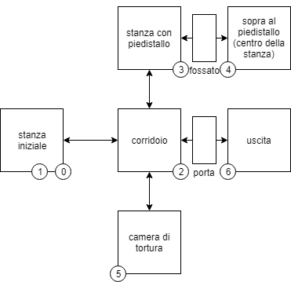
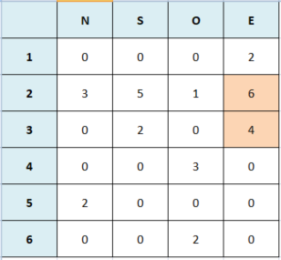
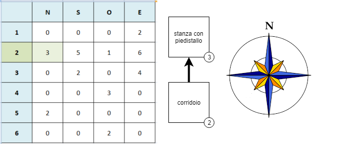
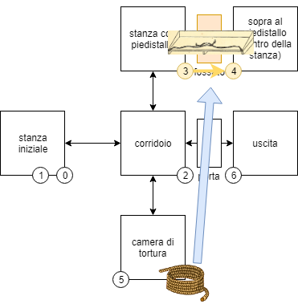

# LO STATO INTERNO DEL GIOCO

**AVVISO SPOILER**

Continuando a leggere, verrai a conoscenza di alcuni dettagli del gioco, che potrebbero precludere la possibilità di giocarvi.

## INTRODUCTION

Lo stato del gioco è rappresentato da un insieme di variabili, che descrivono i fatti salienti del gioco. Le variabili sono:

- **x**: in quale stanza si trova il giocatore? 0-6
- **a**: il giocatore ha preso la corda? 0 = no, 1 = sì
- **b**: il giocatore ha preso la chiave? 0 = no, 1 = sì
- **g**: il giocatore ha usato la corda nella stanza con il piedistallo? 0 = no, 1 = sì
- **h**: il giocatore ha usato la chiave nel corridoio con la porta chiusa? 0 = no, 1 = sì

## LA STANZA ATTUALE (x)

La stanza in cui si trova il giocatore (**x**) è una delle sei stanze del gioco, disposte come segue (vedi mappa):

* **0-1**: stanza iniziale
* **2**: corridoio
* **3**: stanza con piedistallo
* **4**: sopra al piedistallo (centro della stanza)
* **5**: camera di tortura
* **6**: uscita!

La ripetizione della "stanza iniziale" per i valori 0 e 1 è necessaria per poter produrre una diversa descrizione della stessa. La differenza è tra la prima volta che viene mostrata al giocatore e la successiva, e sta interamente nel punto iniziale della decodifica della descrizione. Questa tecnica consente di aggiungere e un ulteriore livello di compressione nelle descrizioni. È utilizzata anche in altre parti del gioco (come, ad esempio, nell'inventario). Pertanto, la prima volta che viene visualizzata la descrizione della stanza iniziale, il numero della stanza viene automaticamente cambiato da 0 a 1 (**x = 1**).

Le connessioni tra le stanze sono descritte da una singola matrice di 6 righe per 4 colonne, linearizzata come una stringa nella variabile **m$**. Una riga di 4 cifre rappresenta una stanza, mentre ogni colonna (6 cifre) rappresenta il nuovo valore di **x** se l'utente sceglie di spostarsi (rispettivamente) verso **N**ord (prima cifra), **S**ud (seconda cifra), **O**vest (terza cifra) o **E**st (quarta cifra) a partire da quella specifica stanza.

Quindi se il giocatore è nella stanza n. 2 (**x = 2**) e inserisce <code>N</code>, il gioco lo porterà nella stanza n. 3 (**x = 3**).

Sebbene nel gioco attuale tutte le connessioni siano bidirezionali, questo non è obbligatorio. Sarebbe stato possibile rappresentare, ad esempio, lo "scivolare" in una stanza da cui il giocatore non poteva uscire, costringendo così il giocatore in un determinato percorso dell'avventura.

## LE VARIABILI DI STATO (a,b,g,h)

Viene presentata una descrizione diversa in base alla stanza in cui si trova il giocatore (vedi sopra) e allo stato corrente delle altre variabili di stato (**a, b, g, h**). Per garantire la migliore descrizione possibile della situazione, lo stato del gioco è rappresentato da due descrizioni correlate:
* **descrizione della stanza**: la situazione della stanza e la descrive in modo generico (guidato dalla variabile **x**);
* **descrizione dello status**: rappresenta qualsiasi elemento aggiuntivo che può cambiare in base allo stato delle variabili (guidato dalla variabile **q**, ovvero una combinazione lineare di variabili di stato).

Poiché entrambe le descrizioni sono sempre presenti, se non esiste una descrizione dello stato (**q = 0**), ciò viene rappresentato da un messaggio standard (<code>NIENT'ALTRO</code>).

## VINCOLI DI MOVIMENTO BASATI SULLO STATO 

Oltre ai vincoli di movimento espliciti, come quelli indotti dalla matrice (vedi sopra), vi sono anche vincoli che si basano sulle variabili di stato correnti (quelle indicate dallo sfondo di colore arancione). **Questi vincoli impediscono al giocatore di spostarsi in alcune stanze fino a quando determinate condizioni non siano soddisfatte.** Ciò accade, ad esempio, nella stanza del corridoio, con una porta chiusa a chiave che blocca l'uscita del giocatore.

I cambiamenti di stato si intersecano con l'[interprete](parser.md). Infatti, una volta che il verbo (**v**) e l'oggetto (**o**) sono stati decodificati, i loro valori vengono utilizzati per variare lo stato delle suddette variabili. Questa variazione è soggetta a criteri di fattibilità, vale a dire (ad esempio) che tale criterio può basarsi sul fatto di essere nella stanza giusta o di aver precedentemente preso possesso di altri oggetti necessari. Una volta calcolato tale criterio, viene calcolata la stanza di destinazione e l'interprete verificherà nuovamente il risultato completo. Se qualcosa va storto, emetterà un errore.

Per comprendere meglio il meccanismo, si può prendere l'esempio dell'oggetto corda. Questo oggetto (**o = 1**) si trova nella stanza n. 5 (**x = 5**), ed è descritto in quella stanza quando entra il giocatore. Se l'interprete capisce che il giocatore ha richiesto di prendere (**v = 5**) solo quell'oggetto, il gioco controllerà se questo è possibile, con questa formula: la corda può essere presa solo e solo se non ha già preso (**a = 0**) e il giocatore è nella stanza. nr. 5 (**x = 5**).

In breve:

<pre>a=-(a=1)+((x=5)*(a=0)*(v=5)*(o=1))</pre>

In assenza di una di queste condizioni, **lo stato non cambia affatto** e, in assenza della condizione di possesso (**a = 1**) quando l'utente ha chiesto di prendere (**v = 5** ) la corda (**o = 1**), l'interprete emetterà un errore. Usando le variabili di stato correnti, il programma bloccherà il movimento calcolando uno 0 per la stanza di destinazione, se le condizioni non sono soddisfatte. Ancora una volta, l'interprete emetterà un errore se la stanza successiva è zero (**x = 0**) quando un verbo è un movimento (**v<5**).

## IL PUNTEGGIO

L'avanzamento del gioco, in termini di interazione con l'ambiente, è rappresentato da un punteggio. **Il punteggio dipende dalla somma di tutti gli stati indicati sopra**. Il punteggio, che viene disegnato nella parte in alto a destra dello schermo e viene aggiornato con ogni interazione, viene declinato come segue:
- punteggio all'inizio: **0/4**
- quando si prende la corda: **1/4**
- quando si usa la corda (nel posto giusto): **2/4**
- quando si prende la chiave: **3/4**
- quando si usa la chiave (nel posto giusto): **4/4**
