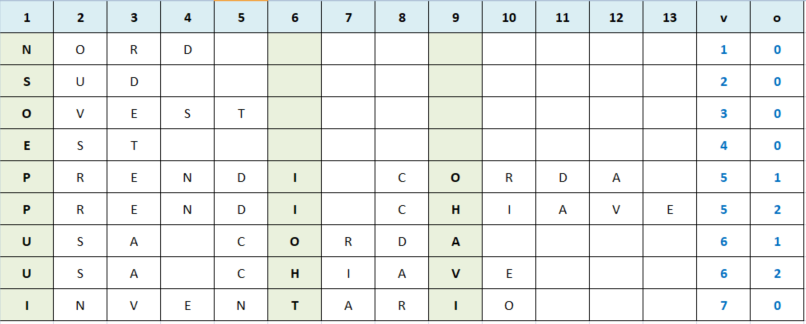

# UN INTERPRETE DEDUTTIVO

L'interprete rappresenta una delle maggiori difficoltà per chi programma un gioco di avventura testuale. In parte perché il linguaggio naturale è ambiguo e richiede molte analisi per comprendere l'intenzione del giocatore; in parte perché l'estrema libertà lasciata al giocatore determina un grande sforzo nel predire le interazioni più frequenti.

Era impensabile introdurre un interprete sofisticato con così poche righe disponibili. D'altra parte, volendo lasciare l'illusione di una libertà di digitazione, era comunque necessario gestire i casi più importanti, restituendo un messaggio di incomprensione quando non era possibile comprendere ciò che l'utente aveva digitato. Le dimensioni ridotte della sceneggiatura hanno permesso di adottare un meccanismo di analisi dell'input deduttivo. È stato quindi possibile dedurre l'insieme di parole da riconoscere e la loro combinazione. In breve, **la presenza di alcune lettere nella digitazione implica l'interpretazione di quei comandi e azioni specifici**.

Qui sotto elenchiamo l'insieme di verbi necessari:

<table>
    <tr>
        <td>NORD</td>
        <td>SUD</td>
        <td>OVEST</td>
        <td>EST</td>
    </tr>
    <tr>
        <td>PRENDI</td>
        <td>USA</td>
        <td>INVENTARIO</td>
        <td></td>
    </tr>
</table>

Questo è, invece, l'insieme dei nomi necessari:

<table>
    <tr>
        <td>CORDA</td>
        <td>CHIAVE</td>
    </tr>
</table>

La matrice combinatoria di entrambe le tabelle rappresenta l'insieme complessivo di comandi che l'interprete dovrà riconoscere:

<table>
    <tr>
        <td>NORD</td>
        <td>SUD</td>
        <td>OVEST</td>
        <td>EST</td>
    </tr>
    <tr>
        <td>PRENDI CORDA</td>
        <td>PRENDI CHIAVE</td>
        <td>USA CORDA</td>
        <td>USA CHIAVE</td>
    </tr>
    <tr>
        <td>INVENTARIO</td>
        <td></td>
        <td></td>
        <td></td>
    </tr>
</table>

Per distinguere ciascun comando, sarà sufficiente eseguire un campionamento di ciò che è stato scritto, per identificare ciò che distingue una di queste espressioni dall'altra.

Nel caso specifico, è stato scelto di campionare il carattere in posizione 1, 6 e 9. Sulla base di questa analisi, è possibile popolare due variabili di stato: il verbo (**v**) e l'oggetto (**o**). Questi due numeri possono quindi essere manipolati in modo più rapido e conciso delle relative stringhe, e possono essere utilizzati per modificare il valore di altre variabili di stato, per procedere con il gioco come indicato nello [stato del gioco interno](game-state.md).

Che l'interprete capisca o meno l'input del giocatore, verrà stampato un messaggio appropriato tra quelli forniti (verde se ok, rosso se vi è un errore). Anche in questo caso, come nel caso delle descrizioni e degli stati, la scelta del messaggio viene effettuata in base a determinate condizioni (vedere [stato del gioco interno](game-state.md) per ulteriori informazioni).

PS. per una migliore esperienza d'uso, ad ogni interazione sarà emessa una nota sonora: una sorta di "bip", che serve ad indicare che il sistema è pronto ad accettare il comando successivo.
